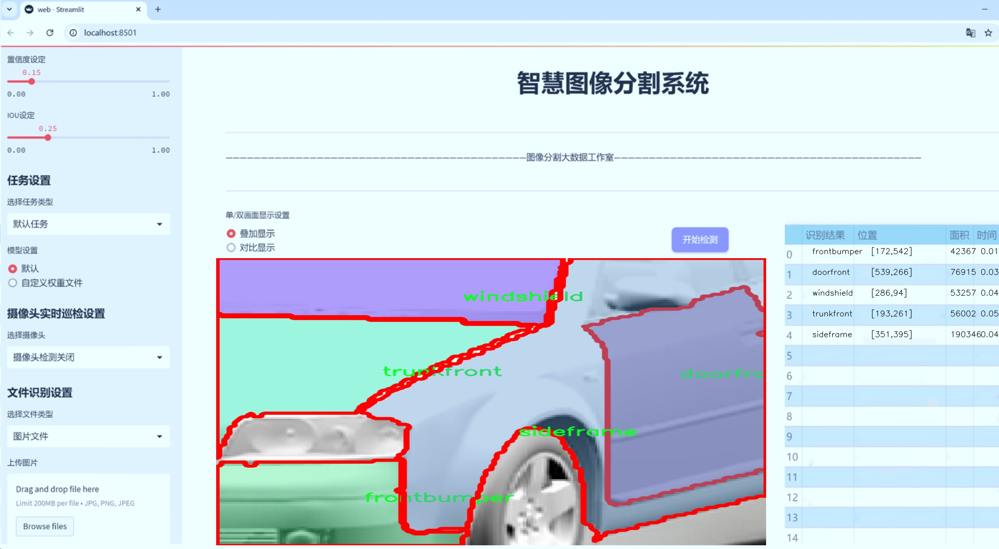
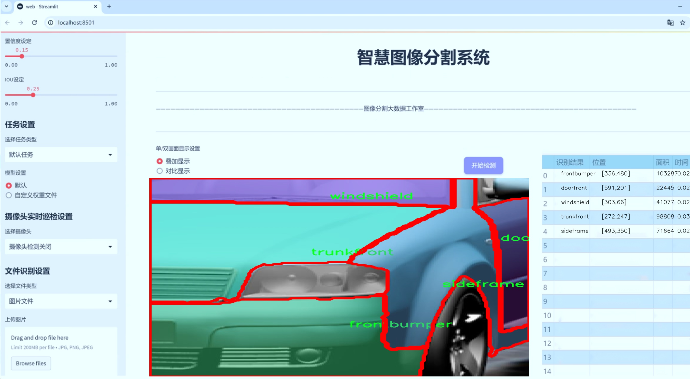
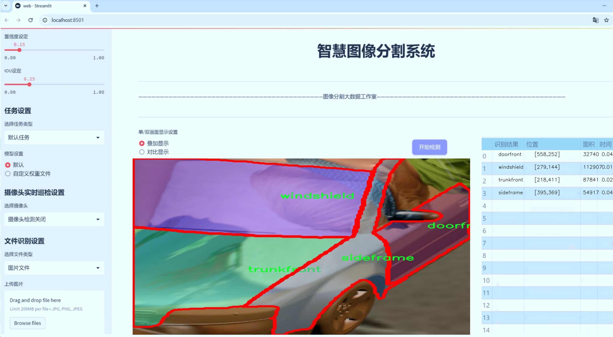
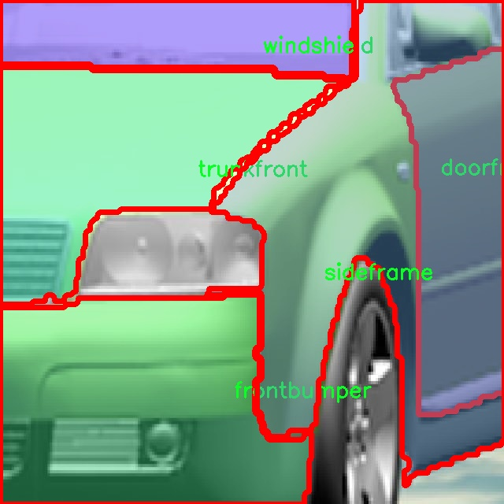
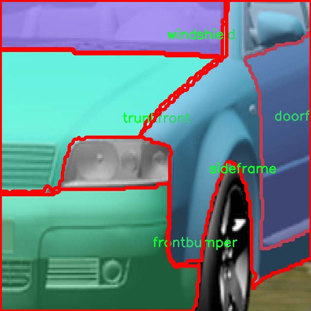
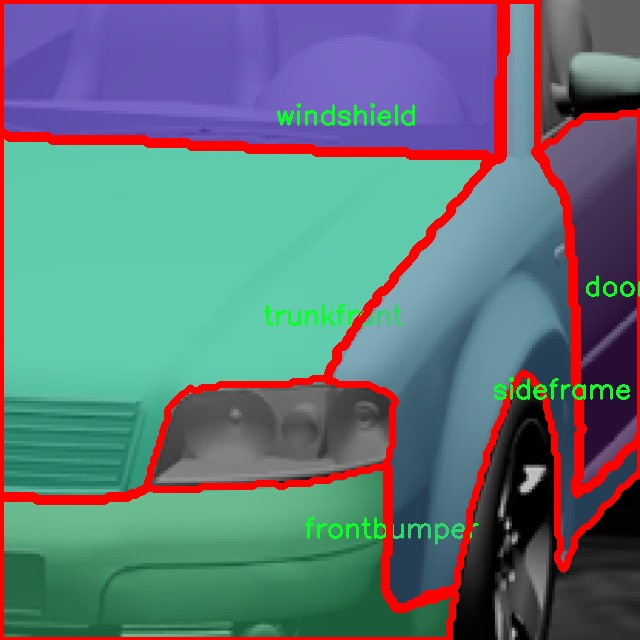
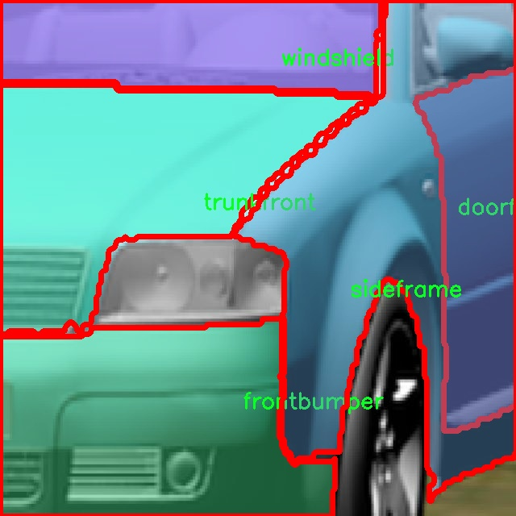

# 汽车部件实例分割系统源码＆数据集分享
 [yolov8-seg-C2f-DAttention＆yolov8-seg-C2f-Faster-EMA等50+全套改进创新点发刊_一键训练教程_Web前端展示]

### 1.研究背景与意义

项目参考[ILSVRC ImageNet Large Scale Visual Recognition Challenge](https://gitee.com/YOLOv8_YOLOv11_Segmentation_Studio/projects)

项目来源[AAAI Global Al lnnovation Contest](https://kdocs.cn/l/cszuIiCKVNis)

研究背景与意义

随着智能交通和自动驾驶技术的迅猛发展，汽车行业正经历着前所未有的变革。在这一背景下，汽车部件的检测与识别成为了实现智能化、自动化的重要基础。传统的汽车部件检测方法往往依赖于人工标注和经验规则，效率低下且容易受到人为因素的影响。近年来，深度学习技术的快速发展为汽车部件的实例分割提供了新的解决方案，尤其是基于卷积神经网络（CNN）的目标检测算法，如YOLO（You Only Look Once）系列，因其高效性和准确性而受到广泛关注。

YOLOv8作为YOLO系列的最新版本，具备了更强的特征提取能力和更快的推理速度，能够在复杂场景中实现实时目标检测。然而，尽管YOLOv8在目标检测方面表现优异，但在实例分割任务中仍然存在一定的局限性。实例分割不仅需要识别目标物体的类别，还需要精确地划分出物体的轮廓，这对算法的性能提出了更高的要求。因此，基于改进YOLOv8的汽车部件实例分割系统的研究具有重要的理论价值和实际意义。

本研究所使用的数据集包含4700张图像，涵盖了11个汽车部件类别，包括后保险杠、后备厢、后窗、后门、前门、前保险杠、车标、车顶、侧框、前备厢和挡风玻璃。这些数据的多样性和丰富性为模型的训练提供了良好的基础，使得实例分割系统能够在不同的汽车部件上进行有效的学习与推广。通过对这些部件的精确分割，能够为后续的自动化检测、故障诊断和智能制造提供重要支持。

此外，改进YOLOv8的实例分割系统不仅可以提升汽车部件的检测精度，还能为智能交通系统的构建提供数据支撑。通过对汽车部件的实时监测和分析，可以实现对车辆状态的动态评估，从而为安全驾驶和维护保养提供科学依据。同时，该系统还可以与其他智能系统进行联动，推动智能交通、车联网等领域的发展。

综上所述，基于改进YOLOv8的汽车部件实例分割系统的研究，不仅能够推动深度学习技术在汽车行业的应用，还能够为智能交通和自动驾驶技术的发展提供重要的支持。通过对汽车部件的精准识别与分割，能够有效提升汽车的智能化水平，促进汽车产业的转型升级，具有重要的学术价值和广泛的应用前景。

### 2.图片演示







##### 注意：由于此博客编辑较早，上面“2.图片演示”和“3.视频演示”展示的系统图片或者视频可能为老版本，新版本在老版本的基础上升级如下：（实际效果以升级的新版本为准）

  （1）适配了YOLOV8的“目标检测”模型和“实例分割”模型，通过加载相应的权重（.pt）文件即可自适应加载模型。

  （2）支持“图片识别”、“视频识别”、“摄像头实时识别”三种识别模式。

  （3）支持“图片识别”、“视频识别”、“摄像头实时识别”三种识别结果保存导出，解决手动导出（容易卡顿出现爆内存）存在的问题，识别完自动保存结果并导出到tempDir中。

  （4）支持Web前端系统中的标题、背景图等自定义修改，后面提供修改教程。

  另外本项目提供训练的数据集和训练教程,暂不提供权重文件（best.pt）,需要您按照教程进行训练后实现图片演示和Web前端界面演示的效果。

### 3.视频演示

[3.1 视频演示](https://www.bilibili.com/video/BV1Tfm5Y2EBx/)

### 4.数据集信息展示

##### 4.1 本项目数据集详细数据（类别数＆类别名）

nc: 10
names: ['Backbumper', 'backtrunk', 'doorback', 'doorfront', 'frontbumper', 'nameplate', 'roof', 'sideframe', 'trunkfront', 'windshield']


##### 4.2 本项目数据集信息介绍

数据集信息展示

在本研究中，我们采用了名为“carr”的数据集，以训练和改进YOLOv8-seg的汽车部件实例分割系统。该数据集专注于汽车部件的细致识别与分割，涵盖了10个主要类别，旨在为汽车行业的智能化和自动化提供支持。数据集的类别包括：后保险杠（Backbumper）、后备厢（backtrunk）、后门（doorback）、前门（doorfront）、前保险杠（frontbumper）、车标（nameplate）、车顶（roof）、侧框架（sideframe）、前备厢（trunkfront）以及挡风玻璃（windshield）。这些类别的选择反映了汽车结构的复杂性和多样性，为实例分割任务提供了丰富的训练样本。

“carr”数据集的构建考虑到了汽车部件的多样性和不同视角下的表现，确保了数据的全面性和代表性。每个类别的样本均经过精心标注，标注过程遵循严格的标准，以确保数据的准确性和一致性。这种高质量的标注不仅为模型训练提供了坚实的基础，也为后续的模型评估和优化奠定了良好的条件。

在数据集的使用过程中，我们特别关注实例分割任务的特性。与传统的目标检测任务不同，实例分割不仅需要识别出目标物体的类别，还需要精确地划分出物体的轮廓。这就要求数据集中每个类别的样本都必须具备清晰的边界标注。为此，数据集中的每个图像都配备了相应的分割掩码，能够帮助模型学习到更为细致的特征。这种细粒度的标注方式，使得YOLOv8-seg能够在复杂背景下，准确地分离出不同的汽车部件，提升了模型的鲁棒性和准确性。

此外，数据集的多样性体现在不同的拍摄角度、光照条件和背景环境上。这种多样性不仅提高了模型的泛化能力，也使得模型在实际应用中能够更好地适应不同的场景。通过在“carr”数据集上进行训练，YOLOv8-seg能够学习到汽车部件在各种条件下的表现，从而在实际应用中实现更高的识别率和分割精度。

在未来的研究中，我们计划进一步扩展“carr”数据集，增加更多的汽车部件类别和样本，以应对日益复杂的实例分割任务。同时，我们也将探索不同的数据增强技术，以提升模型的训练效果和性能。通过不断优化数据集和模型，我们希望能够推动汽车部件实例分割技术的发展，为智能驾驶、自动化维修等领域提供更为精准的技术支持。

综上所述，“carr”数据集不仅为YOLOv8-seg的训练提供了丰富的样本和高质量的标注，也为实例分割任务的研究提供了重要的基础。随着研究的深入，我们期待该数据集能够在汽车行业的智能化进程中发挥更大的作用。










### 5.全套项目环境部署视频教程（零基础手把手教学）

[5.1 环境部署教程链接（零基础手把手教学）](https://www.bilibili.com/video/BV1jG4Ve4E9t/?vd_source=bc9aec86d164b67a7004b996143742dc)


[5.2 安装Python虚拟环境创建和依赖库安装视频教程链接（零基础手把手教学）](https://www.bilibili.com/video/BV1nA4VeYEze/?vd_source=bc9aec86d164b67a7004b996143742dc)

### 6.手把手YOLOV8-seg训练视频教程（零基础小白有手就能学会）

[6.1 手把手YOLOV8-seg训练视频教程（零基础小白有手就能学会）](https://www.bilibili.com/video/BV1cA4VeYETe/?vd_source=bc9aec86d164b67a7004b996143742dc)


按照上面的训练视频教程链接加载项目提供的数据集，运行train.py即可开始训练



     Epoch   gpu_mem       box       obj       cls    labels  img_size
     1/200     0G   0.01576   0.01955  0.007536        22      1280: 100%|██████████| 849/849 [14:42<00:00,  1.04s/it]
               Class     Images     Labels          P          R     mAP@.5 mAP@.5:.95: 100%|██████████| 213/213 [01:14<00:00,  2.87it/s]
                 all       3395      17314      0.994      0.957      0.0957      0.0843

     Epoch   gpu_mem       box       obj       cls    labels  img_size
     2/200     0G   0.01578   0.01923  0.007006        22      1280: 100%|██████████| 849/849 [14:44<00:00,  1.04s/it]
               Class     Images     Labels          P          R     mAP@.5 mAP@.5:.95: 100%|██████████| 213/213 [01:12<00:00,  2.95it/s]
                 all       3395      17314      0.996      0.956      0.0957      0.0845

     Epoch   gpu_mem       box       obj       cls    labels  img_size
     3/200     0G   0.01561    0.0191  0.006895        27      1280: 100%|██████████| 849/849 [10:56<00:00,  1.29it/s]
               Class     Images     Labels          P          R     mAP@.5 mAP@.5:.95: 100%|███████   | 187/213 [00:52<00:00,  4.04it/s]
                 all       3395      17314      0.996      0.957      0.0957      0.0845


### 7.50+种全套YOLOV8-seg创新点代码加载调参视频教程（一键加载写好的改进模型的配置文件）

[7.1 50+种全套YOLOV8-seg创新点代码加载调参视频教程（一键加载写好的改进模型的配置文件）](https://www.bilibili.com/video/BV1Hw4VePEXv/?vd_source=bc9aec86d164b67a7004b996143742dc)

### 8.YOLOV8-seg图像分割算法原理

原始YOLOv8-seg算法原理

YOLOv8-seg算法是YOLO系列中的最新进展，建立在YOLOv5和YOLOv7的基础上，旨在提升目标检测和实例分割的性能。该算法的架构由输入层、主干网络、特征融合层和解耦头组成，展现了出色的实时检测能力和高精度。尽管YOLOv8的相关论文尚未正式发表，但其设计理念和技术细节已引起广泛关注。

在YOLOv8的主干网络中，依然采用了YOLOv5的CSPDarknet结构，但进行了重要的改进。C3模块被C2f模块替代，C2f模块通过引入ELAN思想，增加了多条shortcut连接，从而有效缓解了深层网络中的梯度消失问题。这种设计使得网络能够更好地提取特征，尤其是在处理复杂图像时，能够保持较高的检测精度。此外，YOLOv8的SPPF模块进一步增强了特征提取的能力，提升了对目标的识别效果。

YOLOv8的特征融合层采用了PAN-FPN结构，这一结构的优势在于能够充分融合不同层次的特征信息。具体而言，YOLOv8在上采样阶段删除了YOLOv5中的1x1卷积，直接将高层特征上采样后与中层特征进行连接，确保了信息的高效流动和融合。这种自下而上的特征融合方式，使得模型在处理多尺度目标时，能够兼顾细节和语义信息，从而提高了目标检测的准确性。

在检测头的设计上，YOLOv8采用了Anchor-Free的思想，摒弃了传统的Anchor-Based方法。这一创新使得模型在处理小目标和复杂背景时表现得更加灵活。解耦头的设计允许分类和回归任务独立进行，提升了模型的训练效率和检测精度。YOLOv8的输出特征图分为多个尺度，能够有效应对不同大小的目标，确保了在多种应用场景下的实用性。

损失函数的设计也是YOLOv8的一大亮点。YOLOv8引入了VFLLoss和DFLLoss+CIoULoss的组合，旨在优化分类和回归的训练过程。VFLLoss能够有效处理样本不平衡问题，特别是在小目标检测中，能够提升模型对难以识别样本的关注度。而CIoULoss则通过引入边框的重叠度信息，进一步提高了边框回归的精度。这种损失函数的组合使得YOLOv8在训练过程中能够更好地适应复杂的目标分布，提高了整体的检测性能。

样本匹配策略的改进也是YOLOv8的一大创新。YOLOv8采用了TaskAligned的Assigner匹配方式，取代了传统的静态匹配策略。这一改进使得模型在训练过程中能够更灵活地调整样本的匹配方式，从而提升了模型的适应性和泛化能力。

在数据预处理方面，YOLOv8延续了YOLOv5的策略，采用了多种数据增强手段，如马赛克增强、混合增强、空间扰动和颜色扰动等。这些增强手段的引入，能够有效提高模型的鲁棒性，使其在面对复杂环境时仍能保持良好的检测性能。

综上所述，YOLOv8-seg算法通过一系列创新和改进，提升了目标检测和实例分割的能力。其在主干网络、特征融合、检测头、损失函数及样本匹配等多个方面的优化，使得YOLOv8在实时检测领域中达到了新的高度。随着YOLOv8的推出，目标检测技术将迎来新的发展机遇，推动相关应用的广泛落地。无论是在智能监控、自动驾驶还是机器人视觉等领域，YOLOv8都将发挥重要作用，推动计算机视觉技术的进步。


### 9.系统功能展示（检测对象为举例，实际内容以本项目数据集为准）

图9.1.系统支持检测结果表格显示

  图9.2.系统支持置信度和IOU阈值手动调节

  图9.3.系统支持自定义加载权重文件best.pt(需要你通过步骤5中训练获得)

  图9.4.系统支持摄像头实时识别

  图9.5.系统支持图片识别

  图9.6.系统支持视频识别

  图9.7.系统支持识别结果文件自动保存

  图9.8.系统支持Excel导出检测结果数据


### 10.50+种全套YOLOV8-seg创新点原理讲解（非科班也可以轻松写刊发刊，V11版本正在科研待更新）

#### 10.1 由于篇幅限制，每个创新点的具体原理讲解就不一一展开，具体见下列网址中的创新点对应子项目的技术原理博客网址【Blog】：


[10.1 50+种全套YOLOV8-seg创新点原理讲解链接](https://gitee.com/qunmasj/good)

#### 10.2 部分改进模块原理讲解(完整的改进原理见上图和技术博客链接)【如果此小节的图加载失败可以通过CSDN或者Github搜索该博客的标题访问原始博客，原始博客图片显示正常】

### YOLOv8简介
YOLOv8是一种目标检测模型，是基于YOLO (You Only Look Once)系列算法发展而来的最新版本。它的核心思想是将目标检测任务转化为一个回归问题，通过单次前向传播即可直接预测出图像中的多个目标的位置和类别。
YOLOv8的网络结构采用了Darknet作为其主干网络，主要由卷积层和池化层构成。与之前的版本相比，YOLOv8在网络结构上进行了改进，引入了更多的卷积层和残差模块，以提高模型的准确性和鲁棒性。
YOLOv8采用了一种特征金字塔网络(Feature Pyramid Network,FPN)的结构，通过在不同层级上融合多尺度的特征信息，可以对不同尺度的目标进行有效的检测。此外，YOLOv8还引入了一种自适应感知域(Adaptive Anchors
的机制，通过自适应地学习目标的尺度和
长宽比，提高了模型对于不同尺度和形状目标的检测效果。
总体来说，YOLOv8结构模型综合了多个先进的目标检测技术，在保证检测速度的同时提升了检测精度和鲁棒性，被广泛应用于实时目标检测任务中。


#### yolov8网络模型结构图

YOLOv8 (You Only Look Once version 8)是一种目标检测算法，它在实时场景下可以快速准确地检测图像中的目标。
YOLOv8的网络模型结构基于Darknet框架，由一系列卷积层、池化层和全连接层组成。主要包含以下几个组件:
1.输入层:接收输入图像。
2.卷积层:使用不同尺寸的卷积核来提取图像特征。
3.残差块(Residual blocks):通过使用跳跃连接(skip connections）来解决梯度消失问题，使得网络更容易训练。
4.上采样层(Upsample layers):通过插值操作将特征图的尺寸放大，以便在不同尺度上进行目标检测。
5.池化层:用于减小特征图的尺寸，同时保留重要的特征。
6.1x1卷积层:用于降低通道数，减少网络参数量。
7.3x3卷积层:用于进—步提取和组合特征。
8.全连接层:用于最后的目标分类和定位。
YOLOv8的网络结构采用了多个不同尺度的特征图来检测不同大小的目标，从而提高了目标检测的准确性和多尺度性能。
请注意，YOLOv8网络模型结构图的具体细节可能因YOLO版本和实现方式而有所不同。


#### yolov8模型结构
YOLOv8模型是一种目标检测模型，其结构是基于YOLOv3模型进行改进的。模型结构可以分为主干网络和检测头两个部分。
主干网络是一种由Darknet-53构成的卷积神经网络。Darknet-53是一个经过多层卷积和残差连接构建起来的深度神经网络。它能够提取图像的特征信息，并将这些信息传递给检测头。
检测头是YOLOv8的关键部分，它负责在图像中定位和识别目标。检测头由一系列卷积层和全连接层组成。在每个检测头中，会生成一组锚框，并针对每个锚框预测目标的类别和位置信息。
YOLOv8模型使用了预训练的权重，其中在COCO数据集上进行了训练。这意味着该模型已经通过大规模数据集的学习，具有一定的目标检测能力。

### RT-DETR骨干网络HGNetv2简介
#### RT-DETR横空出世
前几天被百度的RT-DETR刷屏，参考该博客提出的目标检测新范式对原始DETR的网络结构进行了调整和优化，以提高计算速度和减小模型大小。这包括使用更轻量级的基础网络和调整Transformer结构。并且，摒弃了nms处理的detr结构与传统的物体检测方法相比，不仅训练是端到端的，检测也能端到端，这意味着整个网络在训练过程中一起进行优化，推理过程不需要昂贵的后处理代价，这有助于提高模型的泛化能力和性能。


当然，人们对RT-DETR之所以产生浓厚的兴趣，我觉得大概率还是对YOLO系列审美疲劳了，就算是出到了YOLO10086，我还是只想用YOLOv5和YOLOv7的框架来魔改做业务。。

#### 初识HGNet
看到RT-DETR的性能指标，发现指标最好的两个模型backbone都是用的HGNetv2，毫无疑问，和当时的picodet一样，骨干都是使用百度自家的网络。初识HGNet的时候，当时是参加了第四届百度网盘图像处理大赛，文档图像方向识别专题赛道，简单来说，就是使用分类网络对一些文档截图或者图片进行方向角度分类。


当时的方案并没有那么快定型，通常是打榜过程发现哪个网络性能好就使用哪个网络做魔改，而且木有显卡，只能蹭Ai Studio的平台，不过v100一天8小时的实验时间有点短，这也注定了大模型用不了。 

流水的模型，铁打的炼丹人，最后发现HGNet-tiny各方面指标都很符合我们的预期，后面就一直围绕它魔改。当然，比赛打榜是目的，学习才是享受过程，当时看到效果还可以，便开始折腾起了HGNet的网络架构，我们可以看到，PP-HGNet 针对 GPU 设备，对目前 GPU 友好的网络做了分析和归纳，尽可能多的使用 3x3 标准卷积（计算密度最高），PP-HGNet是由多个HG-Block组成，细节如下：


ConvBNAct是啥？简单聊一聊，就是Conv+BN+Act，CV Man应该最熟悉不过了：
```python
class ConvBNAct(TheseusLayer):
    def __init__(self,
                 in_channels,
                 out_channels,
                 kernel_size,
                 stride,
                 groups=1,
                 use_act=True):
        super().__init__()
        self.use_act = use_act
        self.conv = Conv2D(
            in_channels,
            out_channels,
            kernel_size,
            stride,
            padding=(kernel_size - 1) // 2,
            groups=groups,
            bias_attr=False)
        self.bn = BatchNorm2D(
            out_channels,
            weight_attr=ParamAttr(regularizer=L2Decay(0.0)),
            bias_attr=ParamAttr(regularizer=L2Decay(0.0)))
        if self.use_act:
            self.act = ReLU()
 
    def forward(self, x):
        x = self.conv(x)
        x = self.bn(x)
        if self.use_act:
            x = self.act(x)
        return x 
```
且标准卷积的数量随层数深度增加而增多，从而得到一个有利于 GPU 推理的骨干网络，同样速度下，精度也超越其他 CNN ，性价比也优于ViT-base模型。


另外，我们可以看到：

PP-HGNet 的第一层由channel为96的Stem模块构成，目的是为了减少参数量和计算量。PP-HGNet

Tiny的整体结构由四个HG Stage构成，而每个HG Stage主要由包含大量标准卷积的HG Block构成。

PP-HGNet的第三到第五层使用了使用了可学习的下采样层（LDS Layer），该层group为输入通道数，可达到降参降计算量的作用，且Tiny模型仅包含三个LDS Layer，并不会对GPU的利用率造成较大影响.

PP-HGNet的激活函数为Relu，常数级操作可保证该模型在硬件上的推理速度。

### 11.项目核心源码讲解（再也不用担心看不懂代码逻辑）

#### 11.1 ui.py

以下是经过简化和注释的核心代码部分：

```python
import sys
import subprocess
from QtFusion.path import abs_path

def run_script(script_path):
    """
    使用当前 Python 环境运行指定的脚本。

    Args:
        script_path (str): 要运行的脚本路径
    """
    # 获取当前 Python 解释器的路径
    python_path = sys.executable

    # 构建运行命令，使用 streamlit 运行指定的脚本
    command = f'"{python_path}" -m streamlit run "{script_path}"'

    # 执行命令并等待其完成
    result = subprocess.run(command, shell=True)
    
    # 检查命令执行结果，如果返回码不为0，则表示出错
    if result.returncode != 0:
        print("脚本运行出错。")

# 主程序入口
if __name__ == "__main__":
    # 获取要运行的脚本的绝对路径
    script_path = abs_path("web.py")

    # 调用函数运行指定的脚本
    run_script(script_path)
```

### 代码注释说明：
1. **导入模块**：
   - `sys`：用于获取当前 Python 解释器的路径。
   - `subprocess`：用于执行外部命令。
   - `abs_path`：从 `QtFusion.path` 导入的函数，用于获取文件的绝对路径。

2. **`run_script` 函数**：
   - 接收一个脚本路径作为参数，并使用当前 Python 环境运行该脚本。
   - 使用 `sys.executable` 获取当前 Python 解释器的路径。
   - 构建一个命令字符串，用于通过 `streamlit` 运行指定的脚本。
   - 使用 `subprocess.run` 执行命令，并检查返回码以判断脚本是否成功运行。

3. **主程序入口**：
   - 在脚本作为主程序运行时，获取要运行的脚本的绝对路径（这里是 `web.py`）。
   - 调用 `run_script` 函数执行该脚本。

这个程序文件名为 `ui.py`，其主要功能是运行一个指定的 Python 脚本，具体来说是通过 Streamlit 框架来启动一个 Web 应用。

首先，文件导入了几个必要的模块，包括 `sys`、`os` 和 `subprocess`。其中，`sys` 模块用于访问与 Python 解释器相关的变量和函数，`os` 模块提供了与操作系统交互的功能，而 `subprocess` 模块则用于生成新的进程、连接到它们的输入/输出/错误管道，并获取它们的返回码。

接下来，文件从 `QtFusion.path` 模块中导入了 `abs_path` 函数，这个函数的作用是获取给定路径的绝对路径，确保后续操作能够正确找到文件。

在 `run_script` 函数中，首先定义了一个参数 `script_path`，用于接收要运行的脚本的路径。函数内部首先获取当前 Python 解释器的路径，并将其存储在 `python_path` 变量中。然后，构建了一个命令字符串，该命令使用 Streamlit 框架来运行指定的脚本。命令的格式为 `"{python_path}" -m streamlit run "{script_path}"`，这意味着使用当前 Python 环境中的 Streamlit 模块来运行给定的脚本。

接着，使用 `subprocess.run` 方法执行构建好的命令。这个方法会在新的进程中运行命令，并等待其完成。运行结束后，检查返回码，如果返回码不为 0，表示脚本运行出错，程序会输出一条错误信息。

最后，在文件的主程序部分，使用 `if __name__ == "__main__":` 来确保只有在直接运行该文件时才会执行后面的代码。这里指定了要运行的脚本路径为 `web.py`，并调用 `run_script` 函数来执行这个脚本。

总体来看，这个程序的核心功能是通过当前 Python 环境来运行一个 Streamlit Web 应用，提供了一种简单的方式来启动和测试 Web 应用的开发。

#### 11.2 ultralytics\data\annotator.py

以下是代码中最核心的部分，并附上详细的中文注释：

```python
from pathlib import Path
from ultralytics import SAM, YOLO

def auto_annotate(data, det_model='yolov8x.pt', sam_model='sam_b.pt', device='', output_dir=None):
    """
    自动标注图像，使用YOLO目标检测模型和SAM分割模型。

    参数:
        data (str): 包含待标注图像的文件夹路径。
        det_model (str, optional): 预训练的YOLO检测模型。默认为'yolov8x.pt'。
        sam_model (str, optional): 预训练的SAM分割模型。默认为'sam_b.pt'。
        device (str, optional): 运行模型的设备。默认为空字符串（CPU或可用的GPU）。
        output_dir (str | None | optional): 保存标注结果的目录。
            默认为与'data'相同目录下的'labels'文件夹。

    示例:
        auto_annotate(data='ultralytics/assets', det_model='yolov8n.pt', sam_model='mobile_sam.pt')
    """
    # 加载YOLO目标检测模型
    det_model = YOLO(det_model)
    # 加载SAM分割模型
    sam_model = SAM(sam_model)

    # 将数据路径转换为Path对象
    data = Path(data)
    # 如果未指定输出目录，则创建一个默认的输出目录
    if not output_dir:
        output_dir = data.parent / f'{data.stem}_auto_annotate_labels'
    # 创建输出目录（如果不存在）
    Path(output_dir).mkdir(exist_ok=True, parents=True)

    # 使用YOLO模型对数据进行检测，返回检测结果
    det_results = det_model(data, stream=True, device=device)

    # 遍历每个检测结果
    for result in det_results:
        # 获取检测到的类别ID
        class_ids = result.boxes.cls.int().tolist()  # noqa
        # 如果检测到的类别ID不为空
        if len(class_ids):
            # 获取边界框坐标
            boxes = result.boxes.xyxy  # 边界框输出对象
            # 使用SAM模型进行分割，传入边界框
            sam_results = sam_model(result.orig_img, bboxes=boxes, verbose=False, save=False, device=device)
            # 获取分割结果
            segments = sam_results[0].masks.xyn  # noqa

            # 将分割结果写入文本文件
            with open(f'{str(Path(output_dir) / Path(result.path).stem)}.txt', 'w') as f:
                for i in range(len(segments)):
                    s = segments[i]
                    # 如果分割结果为空，则跳过
                    if len(s) == 0:
                        continue
                    # 将分割结果转换为字符串并写入文件
                    segment = map(str, segments[i].reshape(-1).tolist())
                    f.write(f'{class_ids[i]} ' + ' '.join(segment) + '\n')
```

### 代码核心部分解释：
1. **模型加载**：使用`YOLO`和`SAM`类加载预训练的目标检测和分割模型。
2. **路径处理**：使用`Path`处理输入数据路径和输出目录，确保输出目录存在。
3. **目标检测**：通过YOLO模型对输入数据进行目标检测，获取检测结果。
4. **分割处理**：对于每个检测结果，使用SAM模型进行图像分割，并将分割结果保存到文本文件中，文件名与输入图像相同。

这个程序文件是一个用于自动标注图像的脚本，主要利用YOLO（You Only Look Once）目标检测模型和SAM（Segment Anything Model）分割模型来实现图像的自动标注。程序的核心功能是读取指定文件夹中的图像，使用预训练的YOLO模型检测图像中的对象，然后使用SAM模型对检测到的对象进行分割，最后将分割结果保存为文本文件。

程序首先导入了必要的库，包括`Path`用于处理文件路径，以及`SAM`和`YOLO`这两个模型的类。接着定义了一个名为`auto_annotate`的函数，该函数接受多个参数，包括图像数据的路径、YOLO模型和SAM模型的文件名、设备类型（CPU或GPU）以及输出目录。

在函数内部，首先加载YOLO和SAM模型。如果未指定输出目录，程序会自动创建一个以输入数据文件夹名称命名的子文件夹，用于存放标注结果。接下来，程序使用YOLO模型对输入数据进行目标检测，返回检测结果。

对于每个检测结果，程序提取出检测到的类别ID和边界框坐标。如果检测到的类别ID不为空，程序会将边界框传递给SAM模型进行分割，获取分割结果。最后，程序将每个分割结果及其对应的类别ID写入到一个文本文件中，文件名与原图像文件名相同，但后缀为`.txt`。

整体而言，这段代码实现了一个自动化的图像标注流程，适用于需要快速处理大量图像并进行标注的场景。用户只需提供图像数据的路径和所需的模型，程序便会自动完成后续的标注工作。

#### 11.3 ultralytics\utils\triton.py

以下是代码中最核心的部分，并附上详细的中文注释：

```python
from typing import List
from urllib.parse import urlsplit
import numpy as np

class TritonRemoteModel:
    """
    与远程Triton推理服务器模型交互的客户端。

    属性:
        endpoint (str): Triton服务器上模型的名称。
        url (str): Triton服务器的URL。
        triton_client: Triton客户端（HTTP或gRPC）。
        InferInput: Triton客户端的输入类。
        InferRequestedOutput: Triton客户端的输出请求类。
        input_formats (List[str]): 模型输入的数据类型。
        np_input_formats (List[type]): 模型输入的numpy数据类型。
        input_names (List[str]): 模型输入的名称。
        output_names (List[str]): 模型输出的名称。
    """

    def __init__(self, url: str, endpoint: str = '', scheme: str = ''):
        """
        初始化TritonRemoteModel。

        参数可以单独提供，也可以从形式为<scheme>://<netloc>/<endpoint>/<task_name>的'url'参数中解析。

        参数:
            url (str): Triton服务器的URL。
            endpoint (str): Triton服务器上模型的名称。
            scheme (str): 通信方案（'http'或'gRPC'）。
        """
        # 如果没有提供endpoint和scheme，则从URL字符串中解析
        if not endpoint and not scheme:
            splits = urlsplit(url)  # 解析URL
            endpoint = splits.path.strip('/').split('/')[0]  # 获取模型名称
            scheme = splits.scheme  # 获取通信方案
            url = splits.netloc  # 获取网络位置

        self.endpoint = endpoint  # 设置模型名称
        self.url = url  # 设置服务器URL

        # 根据通信方案选择Triton客户端
        if scheme == 'http':
            import tritonclient.http as client  # 导入HTTP客户端
            self.triton_client = client.InferenceServerClient(url=self.url, verbose=False, ssl=False)
            config = self.triton_client.get_model_config(endpoint)  # 获取模型配置
        else:
            import tritonclient.grpc as client  # 导入gRPC客户端
            self.triton_client = client.InferenceServerClient(url=self.url, verbose=False, ssl=False)
            config = self.triton_client.get_model_config(endpoint, as_json=True)['config']  # 获取模型配置

        # 按字母顺序对输出名称进行排序
        config['output'] = sorted(config['output'], key=lambda x: x.get('name'))

        # 定义模型属性
        type_map = {'TYPE_FP32': np.float32, 'TYPE_FP16': np.float16, 'TYPE_UINT8': np.uint8}  # 数据类型映射
        self.InferRequestedOutput = client.InferRequestedOutput  # 设置输出请求类
        self.InferInput = client.InferInput  # 设置输入类
        self.input_formats = [x['data_type'] for x in config['input']]  # 获取输入数据类型
        self.np_input_formats = [type_map[x] for x in self.input_formats]  # 获取numpy数据类型
        self.input_names = [x['name'] for x in config['input']]  # 获取输入名称
        self.output_names = [x['name'] for x in config['output']]  # 获取输出名称

    def __call__(self, *inputs: np.ndarray) -> List[np.ndarray]:
        """
        使用给定的输入调用模型。

        参数:
            *inputs (List[np.ndarray]): 模型的输入数据。

        返回:
            List[np.ndarray]: 模型输出。
        """
        infer_inputs = []  # 初始化输入列表
        input_format = inputs[0].dtype  # 获取输入数据类型
        for i, x in enumerate(inputs):
            # 如果输入数据类型与预期不符，则转换数据类型
            if x.dtype != self.np_input_formats[i]:
                x = x.astype(self.np_input_formats[i])
            # 创建InferInput对象并设置数据
            infer_input = self.InferInput(self.input_names[i], [*x.shape], self.input_formats[i].replace('TYPE_', ''))
            infer_input.set_data_from_numpy(x)  # 从numpy数组设置数据
            infer_inputs.append(infer_input)  # 添加到输入列表

        # 创建输出请求对象
        infer_outputs = [self.InferRequestedOutput(output_name) for output_name in self.output_names]
        # 调用Triton客户端进行推理
        outputs = self.triton_client.infer(model_name=self.endpoint, inputs=infer_inputs, outputs=infer_outputs)

        # 返回输出结果，转换为原始输入数据类型
        return [outputs.as_numpy(output_name).astype(input_format) for output_name in self.output_names]
```

### 代码核心部分说明：
1. **类的定义**：`TritonRemoteModel`类用于与Triton推理服务器的模型进行交互。
2. **初始化方法**：`__init__`方法负责解析URL并设置模型的基本信息，包括输入输出格式和名称。
3. **调用方法**：`__call__`方法允许用户以函数的方式调用模型，接收输入并返回模型的输出。该方法负责处理输入数据类型转换、创建输入和输出请求，并最终调用Triton客户端进行推理。

这个程序文件是一个用于与远程Triton推理服务器模型交互的客户端类，名为`TritonRemoteModel`。该类的主要功能是通过HTTP或gRPC协议与Triton服务器进行通信，以便发送输入数据并接收模型的输出结果。

在类的文档字符串中，详细描述了该类的属性，包括模型的名称、Triton服务器的URL、客户端类型、输入输出格式等。这些属性在初始化时会被设置。

构造函数`__init__`接受三个参数：`url`、`endpoint`和`scheme`。如果没有提供`endpoint`和`scheme`，则会从`url`中解析出这些信息。解析后，类会根据通信协议选择合适的Triton客户端（HTTP或gRPC），并获取模型的配置。模型的输入和输出信息会被提取并存储在类的属性中，包括输入输出的名称和数据类型。

`__call__`方法允许用户通过实例化的对象直接调用模型。该方法接受多个NumPy数组作为输入，首先会检查输入数据的类型是否与模型期望的类型一致，如果不一致则进行类型转换。接着，创建输入对象并将数据设置到这些对象中。然后，构建输出请求并调用Triton客户端的推理方法，最终返回模型的输出结果，输出结果会被转换为原始输入的类型。

整体来看，这个类封装了与Triton推理服务器交互的复杂性，使得用户可以方便地发送数据并获取推理结果，适用于深度学习模型的在线推理场景。

#### 11.4 ultralytics\engine\validator.py

以下是经过简化和注释的核心代码部分，主要集中在模型验证的逻辑上：

```python
import json
import time
from pathlib import Path
import torch
from ultralytics.cfg import get_cfg
from ultralytics.utils import LOGGER, TQDM, callbacks
from ultralytics.utils.torch_utils import select_device, smart_inference_mode

class BaseValidator:
    """
    BaseValidator类用于模型验证的基类，包含验证过程中的主要属性和方法。
    """

    def __init__(self, dataloader=None, save_dir=None, args=None, _callbacks=None):
        """
        初始化BaseValidator实例。

        Args:
            dataloader (torch.utils.data.DataLoader): 用于验证的数据加载器。
            save_dir (Path, optional): 保存结果的目录。
            args (SimpleNamespace): 验证器的配置。
            _callbacks (dict): 存储各种回调函数的字典。
        """
        self.args = get_cfg(overrides=args)  # 获取配置
        self.dataloader = dataloader  # 数据加载器
        self.save_dir = save_dir or Path('results')  # 保存目录
        self.save_dir.mkdir(parents=True, exist_ok=True)  # 创建保存目录
        self.speed = {'preprocess': 0.0, 'inference': 0.0, 'loss': 0.0, 'postprocess': 0.0}  # 速度统计
        self.callbacks = _callbacks or callbacks.get_default_callbacks()  # 回调函数

    @smart_inference_mode()
    def __call__(self, model=None):
        """
        支持验证预训练模型或正在训练的模型。
        """
        self.device = select_device(self.args.device)  # 选择设备
        model.eval()  # 设置模型为评估模式
        self.dataloader = self.dataloader or self.get_dataloader(self.args.data, self.args.batch)  # 获取数据加载器

        bar = TQDM(self.dataloader, desc='Validating', total=len(self.dataloader))  # 进度条
        for batch_i, batch in enumerate(bar):
            # 预处理
            batch = self.preprocess(batch)

            # 推理
            preds = model(batch['img'])

            # 更新指标
            self.update_metrics(preds, batch)

        stats = self.get_stats()  # 获取统计信息
        self.print_results()  # 打印结果
        return stats  # 返回统计信息

    def preprocess(self, batch):
        """预处理输入批次。"""
        return batch  # 这里可以添加实际的预处理逻辑

    def update_metrics(self, preds, batch):
        """根据预测和批次更新指标。"""
        pass  # 这里可以添加实际的指标更新逻辑

    def get_stats(self):
        """返回模型性能的统计信息。"""
        return {}  # 这里可以返回实际的统计信息

    def print_results(self):
        """打印模型预测的结果。"""
        pass  # 这里可以添加实际的结果打印逻辑

    def get_dataloader(self, dataset_path, batch_size):
        """从数据集路径和批次大小获取数据加载器。"""
        raise NotImplementedError('get_dataloader函数未在此验证器中实现')
```

### 代码说明：
1. **BaseValidator类**：这是一个用于模型验证的基类，包含了验证过程中需要的主要属性和方法。
2. **初始化方法**：在初始化时，获取配置、设置数据加载器和保存目录，并初始化速度统计和回调函数。
3. **`__call__`方法**：这是验证的主要入口，设置模型为评估模式，获取数据加载器，并遍历每个批次进行预处理、推理和指标更新。
4. **预处理和更新指标**：`preprocess`和`update_metrics`方法用于处理输入数据和更新模型性能指标，这里可以根据具体需求添加实现逻辑。
5. **获取统计信息和打印结果**：`get_stats`和`print_results`方法用于获取和打印模型的性能统计信息。

该代码片段的目的是为YOLO模型的验证过程提供一个框架，具体的实现细节可以根据实际需求进行扩展。

这个程序文件是Ultralytics YOLO框架中的一个验证器（validator），用于评估模型在测试集或验证集上的准确性。它提供了一些功能和方法来处理模型验证的各个方面，包括数据加载、模型推理、损失计算和结果统计等。

文件开头部分包含了模块的基本信息和使用说明，用户可以通过命令行调用验证功能，指定模型文件、数据集配置文件和图像大小等参数。支持多种模型格式，包括PyTorch、ONNX、TensorRT等。

接下来，定义了一个名为`BaseValidator`的类，作为所有验证器的基类。该类包含了多个属性和方法，用于初始化和执行验证过程。主要属性包括配置参数、数据加载器、模型、设备信息、当前批次索引、统计信息等。

在初始化方法中，`BaseValidator`会根据传入的参数设置配置，并创建保存结果的目录。它还会检查图像大小的有效性，并初始化一些用于存储速度和绘图的字典。

`__call__`方法是验证器的核心，支持对预训练模型或正在训练的模型进行验证。根据是否传入训练器对象，方法会选择不同的验证流程。对于正在训练的模型，会设置相应的设备和数据，并进行模型的评估；对于预训练模型，则会使用`AutoBackend`来加载模型，并准备数据加载器。

在验证过程中，程序会依次进行数据预处理、模型推理、损失计算和后处理，并更新性能指标。每处理完一个批次，程序会记录并更新统计信息，并在需要时绘制验证样本和预测结果。

`match_predictions`方法用于将模型的预测结果与真实标签进行匹配，计算IoU（Intersection over Union）值，并返回正确的预测结果。其他方法如`add_callback`、`run_callbacks`等用于处理回调函数，以便在验证过程中执行特定的操作。

文件中还定义了一些未实现的方法，如`get_dataloader`和`build_dataset`，这些方法需要在子类中具体实现，以适应不同的数据集和验证需求。

总的来说，这个文件为YOLO模型的验证提供了一个灵活的框架，能够处理各种模型格式和数据集，支持多种功能的扩展和定制。

#### 11.5 train.py

以下是经过简化并添加详细中文注释的核心代码部分：

```python
import os
import torch
import yaml
from ultralytics import YOLO  # 导入YOLO模型

if __name__ == '__main__':  # 确保该模块被直接运行时才执行以下代码
    # 设置训练参数
    workers = 1  # 数据加载的工作进程数
    batch = 8  # 每个批次的样本数量
    device = "0" if torch.cuda.is_available() else "cpu"  # 判断是否使用GPU

    # 获取数据集配置文件的绝对路径
    data_path = abs_path(f'datasets/data/data.yaml', path_type='current')

    # 将路径格式转换为Unix风格
    unix_style_path = data_path.replace(os.sep, '/')
    # 获取数据集目录路径
    directory_path = os.path.dirname(unix_style_path)

    # 读取YAML配置文件
    with open(data_path, 'r') as file:
        data = yaml.load(file, Loader=yaml.FullLoader)

    # 修改数据集路径
    if 'train' in data and 'val' in data and 'test' in data:
        data['train'] = directory_path + '/train'  # 训练集路径
        data['val'] = directory_path + '/val'      # 验证集路径
        data['test'] = directory_path + '/test'    # 测试集路径

        # 将修改后的数据写回YAML文件
        with open(data_path, 'w') as file:
            yaml.safe_dump(data, file, sort_keys=False)

    # 加载YOLO模型配置和预训练权重
    model = YOLO(r"C:\codeseg\codenew\50+种YOLOv8算法改进源码大全和调试加载训练教程（非必要）\改进YOLOv8模型配置文件\yolov8-seg-C2f-Faster.yaml").load("./weights/yolov8s-seg.pt")

    # 开始训练模型
    results = model.train(
        data=data_path,  # 指定训练数据的配置文件路径
        device=device,  # 指定训练设备
        workers=workers,  # 数据加载的工作进程数
        imgsz=640,  # 输入图像的大小
        epochs=100,  # 训练的轮数
        batch=batch,  # 每个批次的样本数量
    )
```

### 代码注释说明：
1. **导入必要的库**：导入`os`、`torch`、`yaml`和YOLO模型相关的库。
2. **设置训练参数**：定义数据加载的工作进程数、批次大小和设备（GPU或CPU）。
3. **获取数据集配置文件路径**：使用`abs_path`函数获取数据集配置文件的绝对路径，并转换为Unix风格的路径。
4. **读取和修改YAML文件**：读取YAML文件内容，修改训练、验证和测试集的路径，并将修改后的内容写回文件。
5. **加载YOLO模型**：加载YOLO模型的配置文件和预训练权重。
6. **开始训练模型**：调用`model.train`方法开始训练，传入必要的参数，包括数据路径、设备、工作进程数、图像大小、训练轮数和批次大小。

该程序文件 `train.py` 是一个用于训练 YOLO（You Only Look Once）模型的脚本。首先，它导入了必要的库，包括 `os`、`torch`、`yaml` 和 `ultralytics` 中的 YOLO 模型，以及用于处理路径的 `QtFusion.path` 和用于绘图的 `matplotlib`。

在 `__main__` 块中，程序首先设置了一些训练参数。`workers` 设置为 1，表示使用一个工作进程来加载数据；`batch` 设置为 8，表示每个批次的样本数量；`device` 则根据是否有可用的 GPU 来选择使用 GPU（"0"）还是 CPU（"cpu"）。

接下来，程序获取数据集的 YAML 配置文件的绝对路径，并将路径中的分隔符统一为 Unix 风格。然后，通过 `os.path.dirname` 获取数据集的目录路径。程序打开 YAML 文件并读取其内容，使用 `yaml.load` 方法保持原有顺序。

在读取 YAML 文件后，程序检查是否包含 'train'、'val' 和 'test' 三个键。如果存在，程序将这些键的值修改为相应的训练、验证和测试数据的目录路径，并将修改后的数据写回 YAML 文件中，确保路径的正确性。

随后，程序加载 YOLO 模型的配置文件和预训练权重。这里提供了一个示例路径，用户可以根据需要替换为其他模型配置文件。

最后，程序调用 `model.train` 方法开始训练模型，传入训练数据的配置文件路径、设备、工作进程数量、输入图像大小（640x640）、训练的 epoch 数量（100）以及批次大小（8）。通过这些设置，程序将开始训练 YOLO 模型，利用指定的数据集进行学习。

#### 11.6 ultralytics\nn\modules\__init__.py

以下是代码中最核心的部分，并附上详细的中文注释：

```python
# 导入Ultralytics YOLO模块所需的核心组件
from .block import *        # 导入模块中的块（block）定义
from .conv import *         # 导入卷积层（conv）定义
from .head import *         # 导入模型头部（head）定义
from .transformer import *   # 导入变换器（transformer）定义
```

### 详细注释：
1. **模块导入**：
   - `from .block import *`：导入当前包中的所有块（block）相关的定义。这些块通常是构建神经网络的基本单元，可能包括不同类型的层（如卷积层、激活层等）。
   - `from .conv import *`：导入卷积层的定义。卷积层是卷积神经网络（CNN）的核心组件，负责提取输入数据的特征。
   - `from .head import *`：导入模型的头部定义。模型的头部通常负责将特征图转换为最终的输出，例如分类或检测结果。
   - `from .transformer import *`：导入变换器的定义。变换器是一种用于处理序列数据的模型结构，广泛应用于自然语言处理和计算机视觉任务。

### 总结：
这段代码主要是导入Ultralytics YOLO模型所需的核心模块，构成了模型的基础架构。通过这些模块的组合，可以构建出完整的YOLO模型，用于目标检测等任务。

这个程序文件是Ultralytics YOLO项目中的一个模块初始化文件，命名为`__init__.py`。它的主要作用是导入该模块下的所有子模块，使得用户在使用时可以直接从`ultralytics.nn.modules`中访问这些功能。

文件开头包含了一个版权声明，表明该代码遵循AGPL-3.0许可证。接着，文件中有一个文档字符串，提供了一个使用示例，展示了如何使用该模块中的功能。示例代码中，首先导入了必要的库，包括`ultralytics.nn.modules`和`torch`，然后创建了一个形状为(1, 128, 40, 40)的张量`x`，这是一个典型的输入数据格式，可能用于卷积神经网络。

接下来，示例中实例化了一个卷积层`Conv`，并将其命名为`m`。随后，代码使用`torch.onnx.export`将这个卷积层导出为ONNX格式，方便与其他深度学习框架的兼容性。最后，使用`os.system`命令调用`onnxsim`工具对导出的ONNX模型进行优化，并尝试打开生成的文件。

在文件的最后，使用了相对导入的方式，导入了该模块下的多个子模块，包括`block`、`conv`、`head`和`transformer`。这些子模块可能包含了不同的神经网络组件和功能，供用户在构建和训练YOLO模型时使用。

总的来说，这个文件的主要功能是提供一个模块接口，方便用户使用Ultralytics YOLO的各种神经网络组件，并且提供了一个简单的示例来展示如何使用这些组件。

### 12.系统整体结构（节选）

### 整体功能和构架概括

该项目是一个基于Ultralytics YOLO框架的深度学习目标检测系统。其主要功能包括模型的训练、验证、推理和图像标注。项目通过模块化的设计，提供了灵活的接口和功能，方便用户进行模型的配置、训练和评估。整体架构由多个模块组成，每个模块负责特定的功能，形成一个完整的工作流。

- **训练模块**：负责模型的训练过程，包括数据加载、模型配置和训练过程的管理。
- **验证模块**：用于评估模型在验证集上的性能，计算各种指标并生成结果。
- **推理模块**：提供与Triton推理服务器的接口，支持模型的在线推理。
- **标注模块**：自动标注图像，结合目标检测和分割模型进行处理。
- **用户界面模块**：提供一个简单的用户界面，用于启动和管理模型。

### 文件功能整理表

| 文件路径                                       | 功能描述                                                                 |
|-----------------------------------------------|--------------------------------------------------------------------------|
| `C:\codeseg\codenew\code\ui.py`              | 启动一个Streamlit Web应用，用于用户界面交互，运行指定的Python脚本。    |
| `C:\codeseg\codenew\code\ultralytics\data\annotator.py` | 自动标注图像，使用YOLO和SAM模型进行目标检测和分割。                     |
| `C:\codeseg\codenew\code\ultralytics\utils\triton.py`   | 封装与Triton推理服务器的交互，支持模型推理请求和结果处理。              |
| `C:\codeseg\codenew\code\ultralytics\engine\validator.py` | 提供模型验证功能，评估模型在验证集上的性能，计算损失和指标。            |
| `C:\codeseg\codenew\code\train.py`          | 负责模型的训练过程，包括数据加载、模型配置和训练管理。                 |
| `C:\codeseg\codenew\code\ultralytics\nn\modules\__init__.py` | 初始化模块，导入神经网络组件，提供示例代码。                            |
| `C:\codeseg\codenew\code\ultralytics\models\utils\__init__.py` | 初始化模型工具模块，提供与模型相关的实用功能。                          |
| `C:\codeseg\codenew\code\ultralytics\engine\__init__.py` | 初始化引擎模块，管理训练和验证的核心功能。                              |
| `C:\codeseg\codenew\code\web.py`            | 提供Web界面，可能用于展示模型推理结果或其他交互功能。                   |
| `C:\codeseg\codenew\code\ultralytics\models\yolo\detect\__init__.py` | 初始化YOLO检测模块，管理目标检测相关功能。                              |
| `C:\codeseg\codenew\code\chinese_name_list.py` | 可能用于处理中文名称列表，具体功能需根据代码内容进一步分析。            |
| `C:\codeseg\codenew\code\ultralytics\models\yolo\detect\predict.py` | 实现YOLO模型的推理功能，处理输入数据并生成预测结果。                   |
| `C:\codeseg\codenew\code\model.py`          | 可能包含模型定义和相关功能，具体功能需根据代码内容进一步分析。          |

这个表格整理了每个文件的功能，便于快速了解项目的结构和各个模块的作用。

注意：由于此博客编辑较早，上面“11.项目核心源码讲解（再也不用担心看不懂代码逻辑）”中部分代码可能会优化升级，仅供参考学习，完整“训练源码”、“Web前端界面”和“50+种创新点源码”以“14.完整训练+Web前端界面+50+种创新点源码、数据集获取”的内容为准。

### 13.图片、视频、摄像头图像分割Demo(去除WebUI)代码

在这个博客小节中，我们将讨论如何在不使用WebUI的情况下，实现图像分割模型的使用。本项目代码已经优化整合，方便用户将分割功能嵌入自己的项目中。
核心功能包括图片、视频、摄像头图像的分割，ROI区域的轮廓提取、类别分类、周长计算、面积计算、圆度计算以及颜色提取等。
这些功能提供了良好的二次开发基础。

### 核心代码解读

以下是主要代码片段，我们会为每一块代码进行详细的批注解释：

```python
import random
import cv2
import numpy as np
from PIL import ImageFont, ImageDraw, Image
from hashlib import md5
from model import Web_Detector
from chinese_name_list import Label_list

# 根据名称生成颜色
def generate_color_based_on_name(name):
    ......

# 计算多边形面积
def calculate_polygon_area(points):
    return cv2.contourArea(points.astype(np.float32))

...
# 绘制中文标签
def draw_with_chinese(image, text, position, font_size=20, color=(255, 0, 0)):
    image_pil = Image.fromarray(cv2.cvtColor(image, cv2.COLOR_BGR2RGB))
    draw = ImageDraw.Draw(image_pil)
    font = ImageFont.truetype("simsun.ttc", font_size, encoding="unic")
    draw.text(position, text, font=font, fill=color)
    return cv2.cvtColor(np.array(image_pil), cv2.COLOR_RGB2BGR)

# 动态调整参数
def adjust_parameter(image_size, base_size=1000):
    max_size = max(image_size)
    return max_size / base_size

# 绘制检测结果
def draw_detections(image, info, alpha=0.2):
    name, bbox, conf, cls_id, mask = info['class_name'], info['bbox'], info['score'], info['class_id'], info['mask']
    adjust_param = adjust_parameter(image.shape[:2])
    spacing = int(20 * adjust_param)

    if mask is None:
        x1, y1, x2, y2 = bbox
        aim_frame_area = (x2 - x1) * (y2 - y1)
        cv2.rectangle(image, (x1, y1), (x2, y2), color=(0, 0, 255), thickness=int(3 * adjust_param))
        image = draw_with_chinese(image, name, (x1, y1 - int(30 * adjust_param)), font_size=int(35 * adjust_param))
        y_offset = int(50 * adjust_param)  # 类别名称上方绘制，其下方留出空间
    else:
        mask_points = np.concatenate(mask)
        aim_frame_area = calculate_polygon_area(mask_points)
        mask_color = generate_color_based_on_name(name)
        try:
            overlay = image.copy()
            cv2.fillPoly(overlay, [mask_points.astype(np.int32)], mask_color)
            image = cv2.addWeighted(overlay, 0.3, image, 0.7, 0)
            cv2.drawContours(image, [mask_points.astype(np.int32)], -1, (0, 0, 255), thickness=int(8 * adjust_param))

            # 计算面积、周长、圆度
            area = cv2.contourArea(mask_points.astype(np.int32))
            perimeter = cv2.arcLength(mask_points.astype(np.int32), True)
            ......

            # 计算色彩
            mask = np.zeros(image.shape[:2], dtype=np.uint8)
            cv2.drawContours(mask, [mask_points.astype(np.int32)], -1, 255, -1)
            color_points = cv2.findNonZero(mask)
            ......

            # 绘制类别名称
            x, y = np.min(mask_points, axis=0).astype(int)
            image = draw_with_chinese(image, name, (x, y - int(30 * adjust_param)), font_size=int(35 * adjust_param))
            y_offset = int(50 * adjust_param)

            # 绘制面积、周长、圆度和色彩值
            metrics = [("Area", area), ("Perimeter", perimeter), ("Circularity", circularity), ("Color", color_str)]
            for idx, (metric_name, metric_value) in enumerate(metrics):
                ......

    return image, aim_frame_area

# 处理每帧图像
def process_frame(model, image):
    pre_img = model.preprocess(image)
    pred = model.predict(pre_img)
    det = pred[0] if det is not None and len(det)
    if det:
        det_info = model.postprocess(pred)
        for info in det_info:
            image, _ = draw_detections(image, info)
    return image

if __name__ == "__main__":
    cls_name = Label_list
    model = Web_Detector()
    model.load_model("./weights/yolov8s-seg.pt")

    # 摄像头实时处理
    cap = cv2.VideoCapture(0)
    while cap.isOpened():
        ret, frame = cap.read()
        if not ret:
            break
        ......

    # 图片处理
    image_path = './icon/OIP.jpg'
    image = cv2.imread(image_path)
    if image is not None:
        processed_image = process_frame(model, image)
        ......

    # 视频处理
    video_path = ''  # 输入视频的路径
    cap = cv2.VideoCapture(video_path)
    while cap.isOpened():
        ret, frame = cap.read()
        ......
```


### 14.完整训练+Web前端界面+50+种创新点源码、数据集获取


# [下载链接：D:\Temporary](D:\Temporary)